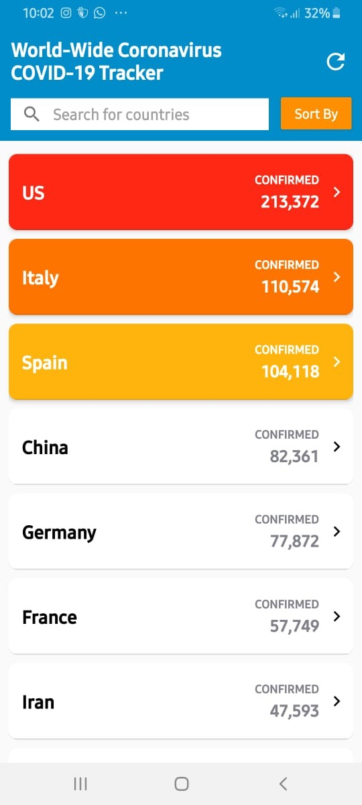
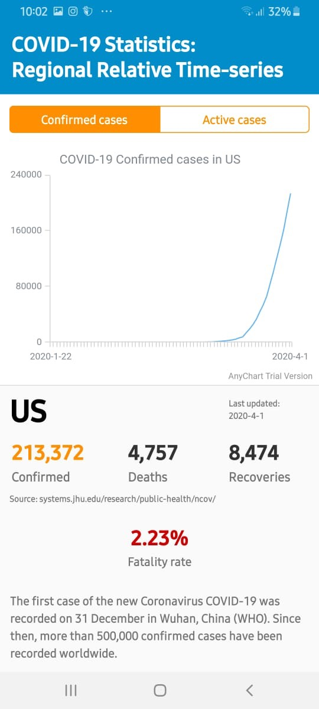

# Android application: COVID-19 Tracker
Android app for tracking the 2019 coronavirus outbreak worldwide.
Data from [CSSEGISandData/COVID-19](https://github.com/CSSEGISandData/COVID-19) transformed into a JSON file by github user [pomber](https://github.com/pomber).

## Here's the app's demo

### Main Screen

### Detail Screen

